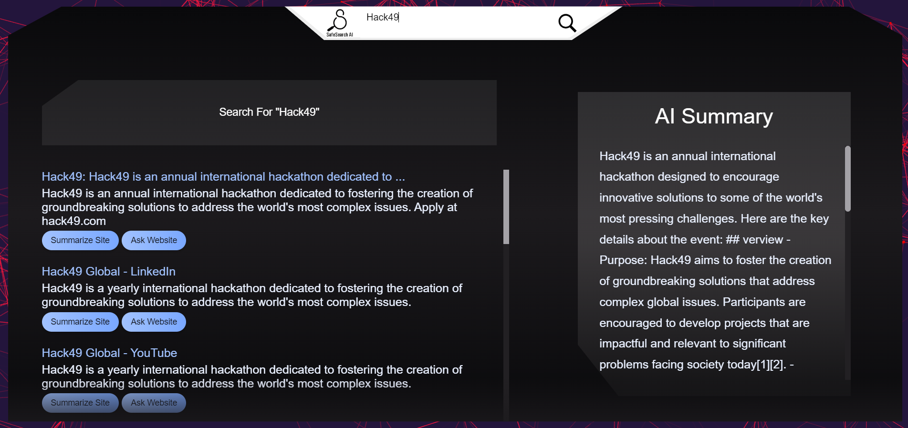
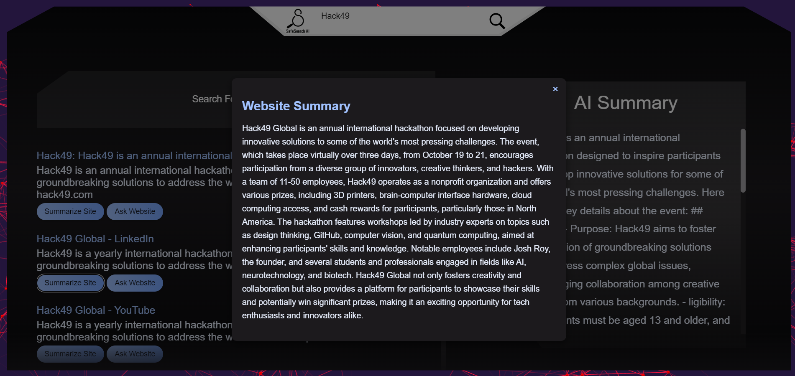

# SafeSearch AI

SafeSearch AI is an AI based privacy-focused AI-powered search engine that helps users surf the web securely. It provides a clean and user-friendly interface while ensuring that personal data is not tracked. The project utilizes AI for smarter search results, along with a summarized view of the web content.

## Features

- **AI-Powered Search**: Input queries and retrieve smart, accurate search results using AI.
- **AI Summary**: Get an instant summary of web pages using AI-powered summarization.
- **Interactive Interface**: Chat with the AI to further refine search queries or ask questions about the topic.
- **Privacy First**: SafeSearch AI does not track or store your search data.
- **Skeleton Loader**: Provides a smooth loading experience while fetching search results and AI summaries.

## How It Works

1. **Search Input**: Users enter their query into the search bar.
2. **Search Results**: The search results are fetched via an API and displayed in a user-friendly format.
3. **AI Summary**: An AI-generated summary is provided for the top results.
4. **Ask the Website**: Users can chat with the AI to further inquire about the topic or website content.

## Screenshots

### Search Interface

### Summarize Website

## Technologies Used

- **HTML5**: The core structure of the application.
- **CSS3**: For styling the layout, buttons, and other UI elements.
- **JavaScript**: Handles the AI-powered search, interaction, and rendering of results.
- **Three.js and Vanta.js**: Used to create an animated, interactive background for the search interface.
- **Marked.js**: For rendering markdown content displayed to summarize other results.
- **WebScout API**: Utilized for fetching real-time search results from various sources.
- **AI Search API**: Powers the AI-driven search and summarization functionalities.

## Contributing

We welcome contributions from the community! If you have any ideas, suggestions, or bug reports, please open an issue or submit a pull request on our GitHub repository.

## License

This project is licensed under the MIT License. See the [LICENSE](LICENSE) file for more details.

## Contact

For any questions or inquiries, please contact us at dawoodwasif1@gmail.com.

Thank you for using SafeSearch AI! We hope it enhances your web browsing experience by making it safer and more efficient.

